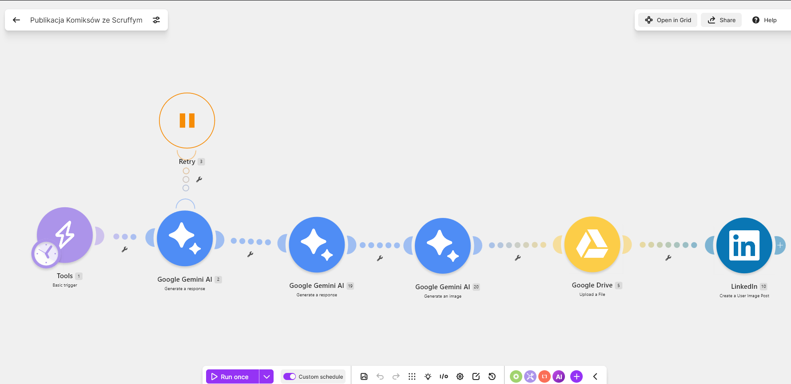

# Scruffy-LinkedIn

Projekt automatyzacji tworzenia i publikowania komiksów ze Scruffym na LinkedInie.

## Cel projektu

Automatyzacja pobiera aktualny temat, przygotowuje pomysł i opis komiksu, generuje grafikę, zapisuje ją na Google Drive, a następnie publikuje post na LinkedInie.

## Schemat działania

1. Ręczne rozpoczęcie scenariusza.
2. Wyszukanie aktualnej wiadomości przy użyciu Google Gemini AI.
3. Przygotowanie opisu i treści komiksu.
4. Wygenerowanie grafiki ze Scruffym.
5. Zapisanie grafiki na Google Drive.
6. Opublikowanie grafiki i treści posta na LinkedInie.

8. 🖼️ [Zobacz przykładowy post ze Scruffym](docs/przyklad-postu.md)

## Używane narzędzia

* Make — obsługa automatyzacji
* Google Gemini AI — przygotowanie treści i generowanie grafiki
* Google Drive — przechowywanie wygenerowanych grafik
* LinkedIn — publikowanie gotowych postów
* GitHub — dokumentacja i przechowywanie oczyszczonego blueprintu

## Modele AI

W scenariuszu używane są modele:

* `gemini-2.5-flash`
* `gemini-3.1-flash-lite`
* `gemini-3.1-flash-image`

## Struktura repozytorium

* `Make/` — oczyszczony blueprint scenariusza Make
* `docs/grafiki/` — przykładowe grafiki bohatera Scruffy
* `README.md` — opis projektu

## Blueprint scenariusza

Oczyszczony blueprint znajduje się w pliku:

`Make/publikacja-komiksow-scruffy-sanitized.json`

Z pliku usunięto prywatne identyfikatory połączeń, dane konta oraz identyfikator folderu Google Drive.

Aby użyć blueprintu we własnym koncie Make, trzeba zaimportować plik, utworzyć własne połączenia z usługami oraz wskazać własny folder Google Drive.

## Bezpieczeństwo

Repozytorium nie zawiera haseł, tokenów API, prywatnych adresów e-mail ani aktywnych danych dostępowych.

## Status projektu

Projekt jest rozwijany. Scenariusz automatyzacji działa według ustawionego harmonogramu, a kolejne materiały i opisy będą dodawane do repozytorium.
