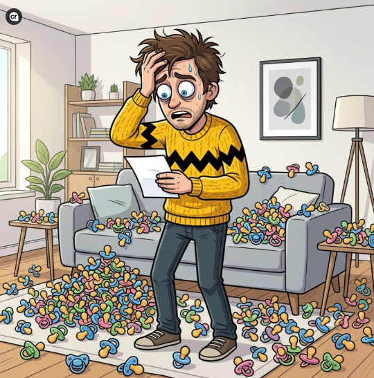

# Przykładowy post ze Scruffym

Poniżej znajduje się rzeczywisty przykład grafiki i tekstu przygotowanych przez scenariusz automatyzacji oraz opublikowanych na LinkedInie.

## Wygenerowana grafika

## Treść posta

### Co dziś na to Scruffy

Szef Telegramu, Paweł Durow, planuje przekazać swój majątek ponad setce spłodzonych przez siebie dzieci. Ktoś chyba bardzo poważnie potraktował strategię budowania „rodzinnego imperium”. Tymczasem poniżej, jak widać, niektórzy mają problem z jednym spadkobiercą.

## Jak powstał ten post

Scenariusz Make wykonał następujące czynności:

1. wyszukał aktualną wiadomość,
2. przygotował krótki komentarz w stylu Scruffy’ego,
3. utworzył opis sceny komiksowej,
4. wygenerował grafikę,
5. zapisał grafikę na Google Drive,
6. opublikował grafikę i tekst na LinkedInie.

## Informacja

Ten materiał pokazuje przykładowy rezultat działania automatyzacji. Treść wiadomości i grafika mogą być inne przy każdym kolejnym uruchomieniu scenariusza.
